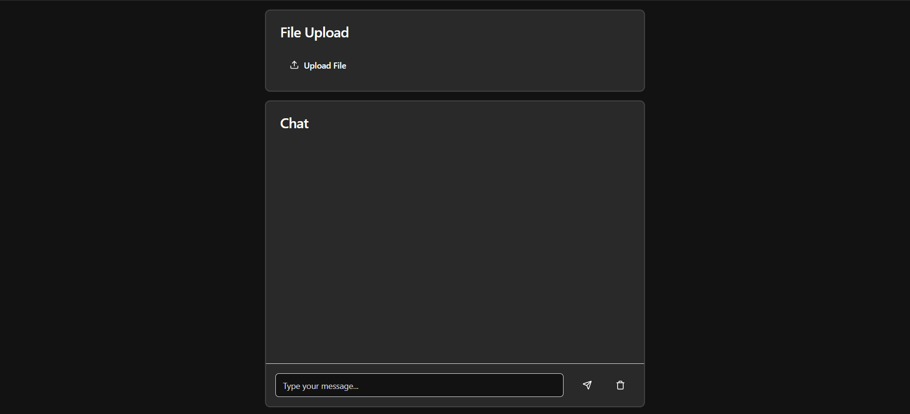

### MLflow Deployement of a RAG pipeline 🥀

This project is for people that want to deploy a RAG pipeline using MLflow.

The project uses:
- `LlamaIndex` and `langchain` as orchestrators
- `Ollama` and `HuggingfaceLLMs`
- `MLflow` as an MLOps framework for deploying and tracking


### How to start

1. Clone the repository
```bash
git clone https://github.com/AnasAber/RAG_in_CPU.git
```

2. Install the dependencies
```bash
pip install -r requirements.txt
```
Make sure to put your api_keys into the `example.env`, and rename it to `.env`


3. Notebook Prep:
- Put your own data files in the data/ folder
- Go to the notebook, and replace "api_key_here" with your huggingface_api_key
- If you have GPU, you're fine, if not, run it on google colab, and make sure to download the json file output at the end of the run.

4. Go to `deployement` folder, and open two terminals:
```bash
python workflow.py
```
And after the run, go to your mlflow run, and pick the run ID:

Place it into this command:
```bash
mlflow models serve -m runs:/<run id>/rag_deployement -p 5001
```
In the other terminal, make sure to run
```bash
app.py
```
5. Open another terminal, and move to the `frontend` folder, and run:
```bash
npm start
```

Now, you should be seeing a web interface, and the two terminals are running.


If you got errors, try to see what's missing in the requirements.txt.

Enjoy!